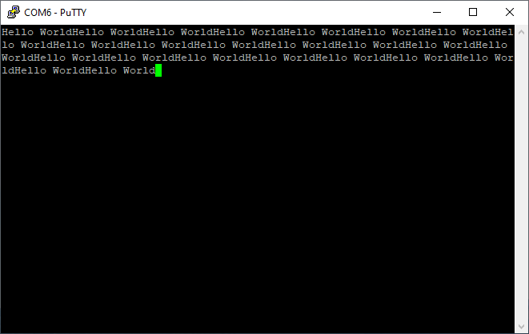

# STM32F411 Hello World USB Serial Example
A simple example of writing "Hello World" to a serial output. Making use of the Virtual Com Port capability with the STM32F411. I am using the Adafruit STM32F411CE Blackpill along with the STM32CubeIde. A full write up on my notes [can be found here](https://www.bennettnotes.com/notes/stm32-blackpill-with-stmcubeide-usb-serial/)

